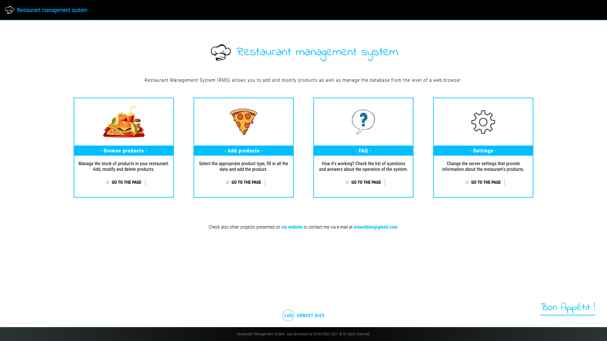
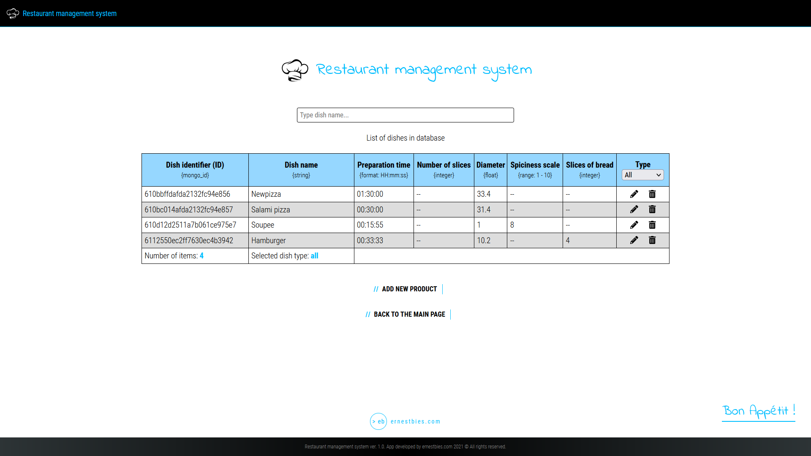
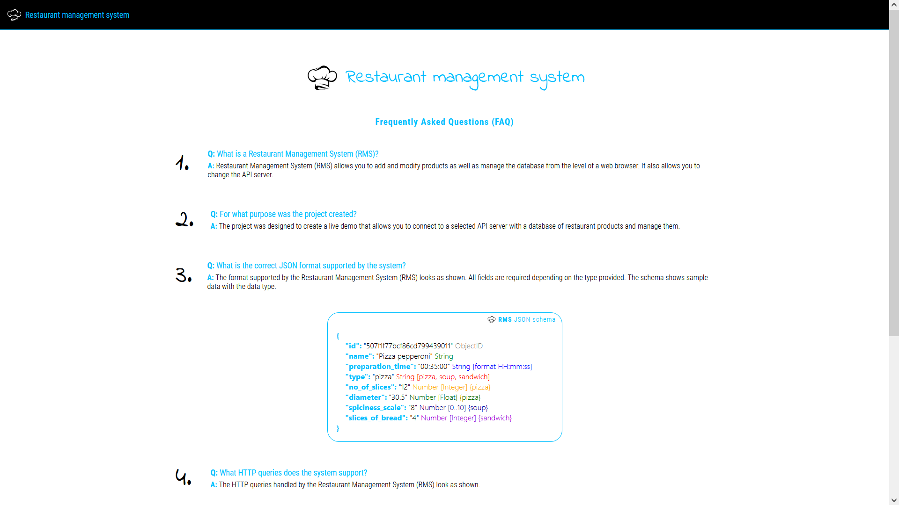
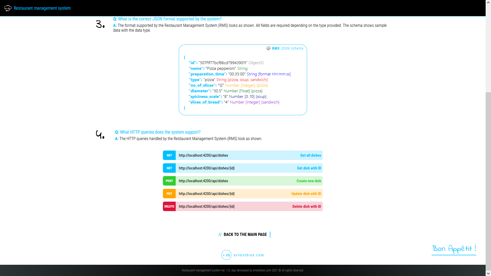
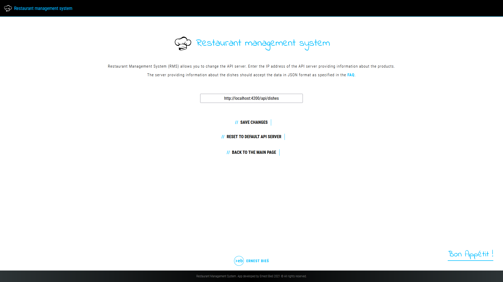

# Restaurant Management System (RMS)
Restaurant Management System (RMS) allows you to add and modify products as well as manage the database from the level of a web browser. It also allows you to change the API server. The project was designed to create a live demo that allows you to connect to a selected API server with a database of restaurant products and manage them.

# Screenshots
1. Main page

2. Browse products

3. Add products

4. FAQ

5. Settings

